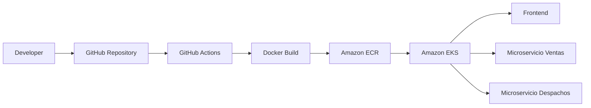

# 🚀 Innovatech Chile | Plataforma DevOps con Amazon EKS y CI/CD

<p align="center">
  
  
  
  
  
  
</p>

Proyecto semestral desarrollado para la asignatura **ISY1101 - Introducción a Herramientas DevOps** de la **Escuela de Informática y Telecomunicaciones - Duoc UC**.

**Innovatech Chile** es una plataforma basada en una arquitectura de microservicios para la gestión de **ventas** y **despachos**, desplegada sobre **Amazon Elastic Kubernetes Service (EKS)** y completamente automatizada mediante un pipeline de **Integración Continua y Entrega Continua (CI/CD)** con **GitHub Actions**.

La solución fue diseñada aplicando principios de **DevOps**, **Infraestructura como Código**, **Zero Trust**, **Alta Disponibilidad**, **Escalabilidad Automática** y **Optimización de costos en AWS**.

---

# 📑 Índice

* [Descripción](#-descripción-del-proyecto)
* [Arquitectura General](#-arquitectura-general)
* [Infraestructura AWS](#-infraestructura-aws)
* [Microservicios](#-microservicios)
* [Pipeline CI/CD](#️-pipeline-cicd)
* [Escalabilidad](#-escalabilidad)
* [Observabilidad](#-observabilidad)
* [Tecnologías](#️-tecnologías-utilizadas)
* [Estructura del Proyecto](#-estructura-del-proyecto)
* [Validación](#-comandos-de-validación)
* [Autores](#-autores)

---

# 📖 Descripción del Proyecto

El objetivo del proyecto consiste en implementar una plataforma moderna desplegada completamente en la nube utilizando herramientas DevOps.

La infraestructura contempla una arquitectura basada en microservicios desplegada sobre **Amazon EKS**, utilizando contenedores Docker almacenados en **Amazon ECR** y desplegados automáticamente mediante **GitHub Actions**.

Entre sus principales características destacan:

* Arquitectura de microservicios
* Contenerización completa con Docker
* Orquestación mediante Kubernetes
* Pipeline CI/CD automatizado
* Escalabilidad automática mediante HPA
* Seguridad basada en Zero Trust
* Alta disponibilidad Multi-AZ
* Observabilidad con CloudWatch y Metrics Server

---

# 🏗 Arquitectura General



---

# ☁ Infraestructura AWS

La plataforma fue desplegada completamente sobre AWS siguiendo una arquitectura escalable y altamente disponible.

## Componentes utilizados

| Servicio              | Función                      |
| --------------------- | ---------------------------- |
| Amazon VPC            | Red privada virtual          |
| Amazon EKS            | Orquestación de Kubernetes   |
| Amazon ECR            | Registro de imágenes Docker  |
| Elastic Load Balancer | Exposición del Frontend      |
| CloudWatch            | Monitoreo y auditoría        |
| Systems Manager       | Administración segura        |
| NAT Gateway           | Salida controlada a Internet |

---

## Red Virtual (VPC)

| Configuración    | Valor               |
| ---------------- | ------------------- |
| CIDR             | 10.0.0.0/16         |
| Arquitectura     | Multi-AZ            |
| Subredes         | Públicas y Privadas |
| Internet Gateway | ✔                   |
| NAT Gateway      | ✔                   |

La infraestructura fue segmentada para separar los componentes públicos de los privados, aumentando la seguridad y la disponibilidad del sistema.

---

# 🔐 Seguridad

La solución implementa un enfoque **Zero Trust**, eliminando accesos innecesarios a la infraestructura.

Características implementadas:

* Administración mediante AWS Systems Manager Session Manager.
* Eliminación del uso de llaves privadas `.pem`.
* Puerto SSH (22) deshabilitado.
* Backend aislado mediante servicios `ClusterIP`.
* Comunicación interna exclusiva dentro del clúster Kubernetes.

---

# ☸ Kubernetes

## Cluster

| Configuración | Valor                  |
| ------------- | ---------------------- |
| Nombre        | innovatech-eks-cluster |
| Kubernetes    | v1.35                  |
| Auto Mode     | Habilitado             |
| Node Type     | T3.LARGE Spot          |

El uso de **Spot Instances** permite reducir significativamente los costos del ambiente de desarrollo manteniendo un rendimiento adecuado.

---

# 📦 Microservicios

La solución se encuentra dividida en tres aplicaciones principales.

| Servicio       | Tecnología  | Función              |
| -------------- | ----------- | -------------------- |
| Frontend       | JavaScript  | Interfaz web         |
| Back Ventas    | Spring Boot | Gestión de ventas    |
| Back Despachos | Spring Boot | Gestión de despachos |

### Frontend

* Servicio tipo **LoadBalancer**
* Acceso público mediante Elastic Load Balancer

### Backend

* Servicios tipo **ClusterIP**
* Comunicación únicamente dentro del clúster Kubernetes

---

# ⚙️ Pipeline CI/CD

Todo el ciclo de vida del software se encuentra completamente automatizado mediante **GitHub Actions**.

## Flujo de despliegue

```text
Developer
     │
     ▼
Push a GitHub
     │
     ▼
GitHub Actions
     │
     ▼
Docker Build
     │
     ▼
Amazon ECR
     │
     ▼
kubectl set image
     │
     ▼
Rolling Update
     │
     ▼
Amazon EKS
```

## Etapas del Pipeline

* Checkout del código fuente.
* Configuración de credenciales AWS STS.
* Construcción de imágenes Docker mediante Multi-stage Build.
* Publicación en Amazon ECR.
* Versionado automático utilizando:

```text
eks-${{ github.run_number }}
```

* Actualización automática del Deployment.
* Rolling Update sin tiempos de inactividad.

---

# 📈 Escalabilidad

Se implementó **Horizontal Pod Autoscaler (HPA)** para adaptar automáticamente la capacidad del sistema según la carga.

Configuración:

* CPU objetivo: **50%**
* Escalado automático de Pods
* Optimización del consumo de recursos

---

# 📊 Observabilidad

La plataforma incorpora herramientas de monitoreo que permiten supervisar el estado del clúster en tiempo real.

## Metrics Server

Permite visualizar el consumo de recursos:

```bash
kubectl top pods -n tienda
```

## Amazon CloudWatch

Se registran eventos relacionados con:

* API Server
* Auditoría
* Autenticación
* Eventos del clúster
* Logs del plano de control

---

# 🛠️ Tecnologías utilizadas

| Tecnología     | Uso                        |
| -------------- | -------------------------- |
| Java           | Backend                    |
| Spring Boot    | Microservicios             |
| JavaScript     | Frontend                   |
| Docker         | Contenedores               |
| Kubernetes     | Orquestación               |
| Amazon EKS     | Cluster Kubernetes         |
| Amazon ECR     | Registro Docker            |
| GitHub Actions | CI/CD                      |
| AWS CloudWatch | Observabilidad             |
| Metrics Server | Métricas                   |
| kubectl        | Administración del clúster |

---

# 📂 Estructura del Proyecto

```text
proyecto-semestral-devops
│
├── .github/
│   └── workflows/
│       └── deploy.yml
│
├── back-Ventas_SpringBoot/
│
├── back-Despachos_SpringBoot/
│
├── front_despacho/
│
└── README.md
```

---

# 🚀 Comandos de Validación

Verificar el estado de los Pods:

```bash
kubectl get pods -n tienda
```

Obtener la dirección pública del Frontend:

```bash
kubectl get svc frontend-service -n tienda
```

Visualizar el consumo de recursos:

```bash
kubectl top pods -n tienda
```

Consultar Deployments:

```bash
kubectl get deployments -n tienda
```

Consultar Servicios:

```bash
kubectl get svc -n tienda
```

---

# ✨ Características Implementadas

* Arquitectura basada en microservicios.
* Contenerización completa con Docker.
* Amazon Elastic Kubernetes Service (EKS).
* Pipeline CI/CD automatizado.
* Integración con Amazon ECR.
* Rolling Updates.
* Horizontal Pod Autoscaler.
* Arquitectura Multi-AZ.
* Seguridad Zero Trust.
* Administración mediante Session Manager.
* Observabilidad con CloudWatch.
* Metrics Server.
* Optimización de costos utilizando Spot Instances.

---

# 🎓 Contexto Académico

**Institución:** Duoc UC

**Escuela:** Informática y Telecomunicaciones

**Asignatura:** ISY1101 - Introducción a Herramientas DevOps

**Proyecto:** Innovatech Chile

---

---

# 📄 Licencia

Este proyecto fue desarrollado con fines exclusivamente académicos como parte del proceso formativo de la asignatura **ISY1101 - Introducción a Herramientas DevOps** en Duoc UC.
